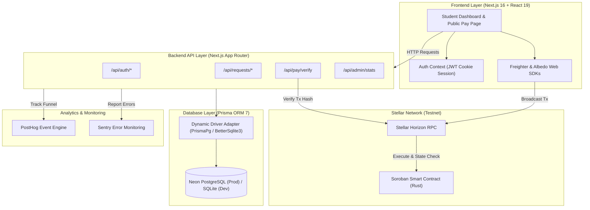

# ScholarPay

[](https://github.com/parasbabar/scholarpay/actions/workflows/ci.yml)
[](https://github.com/parasbabar/scholarpay/actions/workflows/deploy.yml)

> **Stellar-powered cross-border student payment platform built on Soroban smart contracts.**

ScholarPay is a production-grade decentralized payment platform designed to solve international tuition and living expense remittance challenges for students studying abroad. By leveraging the **Stellar Network** and **Soroban Smart Contracts**, ScholarPay replaces slow, high-fee SWIFT bank transfers with near-instant, low-cost, and transparent on-chain transactions.

---

## 🔗 Live Links

- **Live Demo:** https://scholarpay-i6k5ff2p1-parasbabars-projects.vercel.app/
- **Demo Video:** https://youtu.be/ctAeP_o7Pkw?si=4bHZp3fusDgoO_ib
- **User Feedback Form:** https://docs.google.com/forms/d/e/1FAIpQLSd2AKkzq-s-9TFcw4uidQpK87NkyX69DGhg0cc4HbBB_llmxQ/viewform
- **User Feedback Sheet:** https://docs.google.com/spreadsheets/d/1STeVZEM6hJJOdHTsZqqrTlWBRbLHWN-sw9BSSVon0j4/edit?usp=sharing
- **GitHub Repository:** [https://github.com/parasbabar/scholarpay](https://github.com/parasbabar/scholarpay)
- **Stellar Testnet Contract:** [`CAQWR6A4JQIPR5IVPIF47KB2TJQJYFC6IDXXUZ2DRMOFFE4PDONQ7RCQ`](https://stellar.expert/explorer/testnet/contract/CAQWR6A4JQIPR5IVPIF47KB2TJQJYFC6IDXXUZ2DRMOFFE4PDONQ7RCQ)

---

## 🚀 Overview

International students from developing economies often face severe financial hurdles when receiving funds from sponsors or family abroad:
- **High Friction & Costs**: Traditional SWIFT wire transfers incur 5% to 10% in intermediary banking and currency conversion fees.
- **Opaque Delays**: Settlements routinely take 3 to 7 business days with minimal tracking.
- **Lack of Verification**: Educational institutions and students struggle to verify payment status in real-time.

ScholarPay eliminates these inefficiencies:
- **Instant Settlement & Sub-Cent Fees**: Transfers execute on the Stellar Testnet in seconds for a fraction of a cent in network fees (XLM).
- **Public Shareable Payment Links**: Students generate dedicated payment request pages (`/pay/[requestId]`) that enable sponsors to pay without creating an account.
- **Idempotent Smart Contract Recording**: Soroban smart contracts log payment identifiers directly on-chain to guarantee replay protection and auditability.
- **Server-Side Verification**: ScholarPay's API independently queries the Stellar Horizon RPC to validate transaction hashes before confirming status.

---

## ✨ Features

- **Student Request Management** — Create, track, and manage payment requests detailing purpose (Tuition, Rent, Living Expenses), XLM amount, asset type, and deadline.
- **Public Shareable Payment Pages** — Dedicated, public `/pay/[requestId]` pages allowing external family, sponsors, or donors to fulfill payments directly.
- **Dual Wallet Support** — Native browser integration for **Freighter** (extension) and **Albedo** (web popup) wallets for seamless transaction signing.
- **Server-Side Transaction Verification** — Backend validation endpoint (`POST /api/pay/verify`) checks on-chain Horizon records before marking payments as confirmed.
- **Soroban Smart Contract** — On-chain Rust contract deployed on Stellar Testnet for payment execution and status lookup (`is_paid`).
- **Digital Transaction Receipts** — Official receipts generated with direct links to the Stellar Expert Testnet Explorer.
- **In-App & Google Form Feedback** — Integrated 1–5 star rating system on receipt pages and external validation form tracking.
- **Admin Management Portal** — Comprehensive dashboard (/admin) displaying platform metrics, total users, payment volume, and feedback.
- **PostHog Funnel Analytics** — End-to-end event tracking from registration through wallet connection, payment signing, and receipt viewing.
- **Sentry Error Tracking** — Client and server error monitoring with sanitized context logging and automated alerting.

---

## 🧑‍💻 How ScholarPay Works

1. **Account Registration**: Students and senders register via `/register` with role-based profiles (Student or Sender).
2. **Create Payment Request**: The student creates a request via `/dashboard` specifying title, category, XLM amount, deadline, and recipient Stellar address.
3. **Share Payment Link**: ScholarPay generates a unique public URL (`/pay/[requestId]`).
4. **Access Payment Page**: Senders or family members open the public payment link without needing to log in.
5. **Connect Stellar Wallet**: Senders connect their preferred wallet via Freighter or Albedo.
6. **Sign & Broadcast Transaction**: The wallet prompts the user to sign the XLM payment transaction, which is submitted to the Stellar network.
7. **Server Verification**: The client posts the resulting transaction hash to `/api/pay/verify`, where ScholarPay queries Horizon RPC to verify source, destination, amount, and asset code on-chain.
8. **Receipt Generation**: Once verified, the database updates status to `CONFIRMED` and issues a digital receipt (`/receipt/[paymentId]`).
9. **Feedback Submission**: Users can rate their payment experience (1 to 5 stars) and submit qualitative feedback.

---

📸 Screenshots


## 🏗️ Architecture

ScholarPay is architected as a full-stack Next.js App Router application backed by a dynamic database layer, external blockchain RPC nodes, and telemetry pipelines.



---

## 🛠️ Tech Stack

| Category | Technology | Description |
|---|---|---|
| **Framework** | Next.js 16.3.3 | App Router, Server Actions, Turbopack |
| **Language** | TypeScript 5 | Strict type safety across client and server |
| **Frontend UI** | React 19, Tailwind CSS 4 | Custom dark glassmorphic design system |
| **Database** | Prisma ORM 7 | PostgreSQL (Neon Cloud) / SQLite (Local Dev) |
| **Authentication** | JWT (`jose`), `bcryptjs` | HttpOnly, Secure, SameSite=Lax cookie management |
| **Blockchain SDK** | `@stellar/stellar-sdk` v17 | Horizon client, TransactionBuilder, ScVal conversion |
| **Wallets** | `@stellar/freighter-api`, `@albedo-link/intent` | Browser extension and web popup wallet connectors |
| **Smart Contract** | Soroban SDK (`rust`) | Rust contract deployed on Stellar Testnet |
| **Analytics** | PostHog (`posthog-js`) | Product funnel and event tracking |
| **Monitoring** | Sentry (`@sentry/nextjs`) | Real-time crash reporting and exception tracing |
| **Validation** | Zod | Schema validation for API payloads and env vars |
| **Deployment** | Vercel, Neon | Cloud hosting and managed PostgreSQL database |

---

## ⭐ Stellar Integration

ScholarPay is natively built on the Stellar blockchain network:

- **Network**: Stellar **TESTNET**
- **Network Passphrase**: `Test SDF Network ; September 2015`
- **Horizon URL**: `https://horizon-testnet.stellar.org`
- **Soroban RPC URL**: `https://soroban-testnet.stellar.org`
- **Contract Address**: [`CAQWR6A4JQIPR5IVPIF47KB2TJQJYFC6IDXXUZ2DRMOFFE4PDONQ7RCQ`](https://stellar.expert/explorer/testnet/contract/CAQWR6A4JQIPR5IVPIF47KB2TJQJYFC6IDXXUZ2DRMOFFE4PDONQ7RCQ)

### Soroban Smart Contract

The smart contract ([`contracts/scholarpay/src/lib.rs`](./contracts/scholarpay/src/lib.rs)) implements key financial safety guarantees:

```rust
// Executes payment transfer and stores payment_id persistently to prevent replay
pub fn pay(env: Env, sender: Address, recipient: Address, token: Address, amount: i128, payment_id: Symbol)

// View function checking if payment_id was already executed on-chain
pub fn is_paid(env: Env, payment_id: Symbol) -> bool
```

---

## 💳 Payment Flow

```
[Payer Browser] ──(Select Freighter/Albedo)──> [Sign Transaction XDR]
                                                        │
                                          Submit to Stellar Network
                                                        │
                                              Receive Transaction Hash
                                                        │
                                                        ▼
[ScholarPay API /api/pay/verify] <──(Post Tx Hash)───────┘
          │
  Query Horizon RPC Server
          │
  ┌───────┴────────┐
  ▼                ▼
[Valid On-Chain] [Invalid / Unconfirmed]
  │                │
Update DB to      Return Verification Error
CONFIRMED          
  │
Generate Receipt
```

1. Payer connects wallet via Freighter or Albedo on the payment page.
2. The transaction XDR is generated using `@stellar/stellar-sdk` and signed in-browser.
3. The transaction is submitted to the Stellar Testnet.
4. The client sends the resulting transaction hash to ScholarPay's backend (`POST /api/pay/verify`).
5. Backend verifies that:
   - The transaction exists and completed successfully on Horizon.
   - The operation type is a valid payment.
   - The recipient address, asset type (`native` XLM), and payment amount match the stored payment request.
6. The payment status updates to `CONFIRMED`, and the user is redirected to the receipt page.

---

## 👥 User Onboarding & Product Validation

ScholarPay's MVP workflow was validated with over 10 real onboarded test users:
- **User Onboarding**: Participants registered accounts, created test requests, connected wallets, and completed cross-border transactions on Stellar Testnet.
- **Feedback Collection**: Validation responses and wallet addresses were logged via Google Forms and Google Sheets (accessible via the [Live Links](#-live-links) section above).
- **In-App Feedback**: Users submitted star ratings and comments on the digital receipt view, stored in the PostgreSQL database and surfaced in the Admin Dashboard.

---

## 📊 Analytics

Product analytics are powered by **PostHog** ([`src/lib/analytics.ts`](./src/lib/analytics.ts)):

| Event Name | Description |
|---|---|
| `user_registered` | Fires on successful user registration |
| `user_login` | Fires when a user logs in |
| `payment_request_created` | Captures student payment request creation |
| `wallet_connected` | Tracks Freighter or Albedo wallet connection |
| `payment_started` | Tracks initiation of the payment flow |
| `payment_signed` | Fires when transaction XDR is signed by wallet |
| `transaction_submitted` | Fires when tx hash is posted to backend |
| `transaction_confirmed` | Fires when backend confirms on-chain execution |
| `receipt_viewed` | Fires when the payment receipt page is loaded |
| `feedback_submitted` | Captures 1–5 star rating submission |

---

## 🛡️ Monitoring & Error Tracking

Application monitoring is powered by **Sentry** ([`src/lib/monitoring.ts`](./src/lib/monitoring.ts)):
- **Configuration**: Sentry SDK initialized via `withSentryConfig` in [`next.config.ts`](./next.config.ts).
- **Data Hygiene**: Sanitization layer strips sensitive fields (`password`, `token`, `secret`) before event transmission.
- **Verification**: Verified end-to-end locally via `/api/monitoring/test` endpoint, confirming exception capture and event delivery to the Sentry Issues dashboard.

---

## 📱 Responsive Design

ScholarPay is designed mobile-first and fully responsive across smartphones, tablets, and desktop displays. The layout utilizes CSS custom properties, dynamic grid layouts, and glassmorphic card elements for a sleek, modern fintech user experience across all screen sizes.

---

## 🖼️ Product Screenshots

Selected screenshots of the ScholarPay product experience are shown below.

---

## ⚙️ Local Development

### Prerequisites
- Node.js 20.0 or higher
- npm 10.0 or higher
- A Stellar Testnet wallet (Freighter browser extension recommended)

### Installation

1. **Clone the Repository**:
   ```bash
   git clone https://github.com/parasbabar/scholarpay.git
   cd scholarpay
   ```

2. **Install Dependencies**:
   ```bash
   npm install
   ```

3. **Configure Environment Variables**:
   Copy `.env.example` to `.env`:
   ```bash
   cp .env.example .env
   ```

4. **Initialize Database**:
   ```bash
   npx prisma db push
   ```

5. **Start Development Server**:
   ```bash
   npm run dev
   ```
   Access the application at [http://localhost:3000](http://localhost:3000).

6. **Build Production Bundle**:
   ```bash
   npm run build
   ```

---

## 🔐 Environment Variables

Configure the following environment variable names in your `.env` file or cloud platform dashboard:

```env
# Client-Side Configuration (Public)
NEXT_PUBLIC_APP_URL=
NEXT_PUBLIC_STELLAR_NETWORK=
NEXT_PUBLIC_STELLAR_NETWORK_PASSPHRASE=
NEXT_PUBLIC_STELLAR_HORIZON_URL=
NEXT_PUBLIC_STELLAR_RPC_URL=
NEXT_PUBLIC_SOROBAN_CONTRACT_ID=
NEXT_PUBLIC_POSTHOG_KEY=
NEXT_PUBLIC_POSTHOG_HOST=
NEXT_PUBLIC_SENTRY_DSN=

# Server-Only Secrets
DATABASE_URL=
JWT_SECRET=
SENTRY_DSN=
```

---

## 🧪 Testing & Verification

ScholarPay features unit, integration, and live on-chain test suites:

```bash
# Run unit & integration tests (Address validation, status state machine)
npx tsx tests/validation.test.ts

# Run authentication & database integration tests
npx tsx tests/auth.test.ts

# Run live Stellar Testnet on-chain verification tests
npx tsx tests/stellar.test.ts
```

### Verification Highlights:
- `npm run build`: Production build passes cleanly with 21 static & dynamic routes generated.
- `validation.test.ts`: 10/10 unit tests passed.
- `stellar.test.ts`: 5/5 on-chain tests passed against live Stellar Testnet RPC.

---

## 🔄 CI/CD Pipelines

ScholarPay features automated GitHub Actions workflows located in `.github/workflows/`:

### Workflows Overview

| Workflow | Path | Trigger | Description |
|---|---|---|---|
| **CI** | [`.github/workflows/ci.yml`](./.github/workflows/ci.yml) | Push & PR to `master` | Runs Rust format checks, Soroban contract unit tests, builds Soroban WASM artifact, runs Next.js linting (`npm run lint`), runs frontend unit/integration/Stellar on-chain tests, and executes Next.js production build (`npm run build`). |
| **Deployment** | [`.github/workflows/deploy.yml`](./.github/workflows/deploy.yml) | Push to `master` / `workflow_dispatch` | Deploys Next.js application to Vercel production. Supports manual trigger (`workflow_dispatch`) to deploy Soroban contract WASM to Stellar Testnet. |

### Required GitHub Secrets

Configure the following secrets under **Repository Settings > Secrets and variables > Actions**:

- **`VERCEL_TOKEN`**: Vercel Personal Access Token for automated frontend deployment.
  - *How to obtain:* Go to [Vercel Account Tokens](https://vercel.com/account/tokens) -> Click **Create Token** -> Copy the generated token string.
- **`VERCEL_ORG_ID`**: Vercel Organization / Team ID.
  - *How to obtain:* In your Vercel Dashboard, go to **Team Settings -> General** (or check `orgId` in `.vercel/project.json` after running `npx vercel link`).
- **`VERCEL_PROJECT_ID`**: Vercel Project ID.
  - *How to obtain:* In your Vercel Dashboard, open your project -> **Settings -> General** -> Copy **Project ID** (`prj_...`).
- **`STELLAR_SECRET_KEY`**: *(Optional for manual contract deployment)* Stellar Testnet secret key (`S...`) for smart contract deployment.


### Viewing Workflow Results

Navigate to the **Actions** tab of the GitHub repository ([https://github.com/parasbabar/scholarpay/actions](https://github.com/parasbabar/scholarpay/actions)) to inspect live build logs, test results, and compiled contract artifacts (`scholarpay-contract-wasm`).

---

## 📁 Project Structure

```
scholarpay/
├── contracts/
│   └── scholarpay/
│       └── src/lib.rs           # Soroban smart contract (Rust)
├── docs/
│   ├── ARCHITECTURE.md          # Architecture specification
│   ├── DEPLOYMENT.md            # Production deployment guide
│   ├── SMART_CONTRACT.md        # Smart contract documentation
│   ├── USER_FLOW.md             # Complete user flow diagram
│   └── USER_ONBOARDING.md       # User onboarding guide
├── prisma/
│   ├── schema.prisma            # SQLite schema (Local Dev)
│   └── schema.postgresql.prisma # PostgreSQL schema (Production)
├── scripts/
│   └── prisma-generate.mjs      # Dynamic Prisma generator script
├── src/
│   ├── app/                     # Next.js App Router pages & API endpoints
│   │   ├── admin/               # Admin dashboard page
│   │   ├── api/                 # Backend API routes
│   │   ├── dashboard/           # Student dashboard page
│   │   ├── faq/                 # FAQ & onboarding guide page
│   │   ├── login/               # User login page
│   │   ├── pay/[requestId]/     # Public shareable payment page
│   │   ├── receipt/[paymentId]/ # Payment receipt & feedback page
│   │   ├── register/            # User registration page
│   │   └── page.tsx             # Main landing page
│   ├── components/              # Reusable UI components
│   ├── contexts/
│   │   └── AuthContext.tsx      # JWT session context provider
│   └── lib/
│       ├── analytics.ts         # PostHog tracking module
│       ├── auth.ts              # JWT signing & verification
│       ├── db.ts                # Prisma database client initializer
│       ├── env.ts               # Environment variable validator
│       ├── monitoring.ts        # Sentry error capture module
│       └── stellar.ts           # Stellar SDK & Horizon client helpers
├── tests/
│   ├── auth.test.ts             # Auth & DB integration tests
│   ├── stellar.test.ts          # Stellar Testnet live tests
│   └── validation.test.ts       # Address validation & state machine unit tests
├── .env.example                 # Environment variable template
├── next.config.ts               # Next.js & Sentry configuration
└── README.md
```

---

## 📚 Documentation

For deeper technical specifications, refer to the documentation in the [`docs/`](./docs/) directory:
- [`ARCHITECTURE.md`](./docs/ARCHITECTURE.md) — Detailed architecture diagram and layer specifications.
- [`SMART_CONTRACT.md`](./docs/SMART_CONTRACT.md) — Soroban Rust smart contract details and functions.
- [`USER_FLOW.md`](./docs/USER_FLOW.md) — Step-by-step state diagrams for students and senders.
- [`USER_ONBOARDING.md`](./docs/USER_ONBOARDING.md) — User onboarding and testing guide.
- [`DEPLOYMENT.md`](./docs/DEPLOYMENT.md) — Production deployment guidelines for Vercel and Neon.

---

## 📄 License

This project is licensed under the [MIT License](LICENSE).
